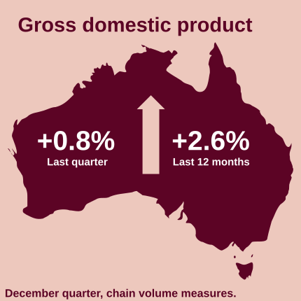
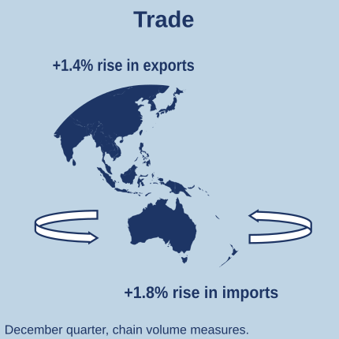
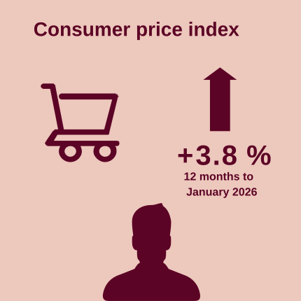
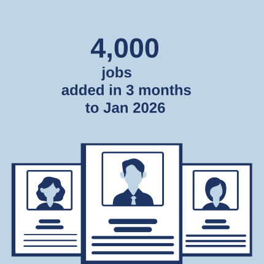
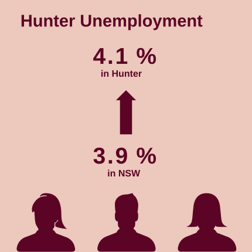
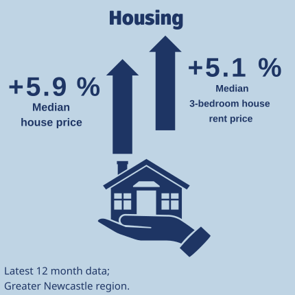

```{=html}
<style>
    h1, h2, h3, h4, h5, h6 {
        color: dThe University of Newcastle's Institute for Regional Futures' Insight Dashboard tracks socio-economic conditions in the Hunter. The dashboard is based on the Hunter Research Foundation Centre's databank collected over 60 years, the most comprehensive collection for any region in Australia.

This dashboard of economic updates is designed to give decision-makers in government, industry and the community the latest data on the Hunter's performance across key indicators. The dashboard draws upon national and regional data sources to deliver insights about the Hunter region. These updates will be provided throughout the year, in addition to the [Hunter Insight Series](https://www.newcastle.edu.au/research/centre/regional-futures/hunter-insight-series). This is the sixth release in this format.

The dashboard is a snapshot of only some of the total data collected by the Institute for Regional Futures. For more information, please contact [irf\@newcastle.edu.au](irf@newcastle.edu.au).ue;
        text-align: center;
    }
    body {
      font-family: Arial, sans-serif;
      line-height: 1.6;
      color: #333333;
      margin: 0;
      padding: 20px;
      text-align: justify;
    }
    h2 {
      text-align: center;
      margin-top: 40px;
      color: darkblue;
      border-bottom: 2px solid #444;
    }
    .toc {
    position: fixed;
    top: 50%;
    transform: translateY(-50%); /* Move the element up by half its own height */
    left: 0;
    width: 200px;
    padding: 10px;
    margin-right: 20px; /* Add margin to the right side */
    background-color: white;
    border-right: 2px solid #ddd;
    box-shadow: 2px 2px 5px rgba(0, 0, 0, 0.1);
    font-size: 15px;
    line-height: 1.5;
    }
    .content {
    margin-left: 20px; /* Adjust the value to match the width of the table of contents */
    }

    .toc ul {
        list-style-type: none;
        margin: 0;
        padding: 0;
    }

    .toc li {
        margin-bottom: 5px;
    }

    .toc a {
        color: darkblue;
        text-decoration: none;
    }

    .toc a:hover {
        text-decoration: underline;
    }

</style>
```
# 

::: {style="text-align: center;"}
# HUNTER INSIGHT DASHBOARD

## Economic Update - March 2026
:::

The University of Newcastle's Institute for Regional Futures' Insight Dashboard tracks socio-economic conditions in the Hunter. The dashboard is based on the Hunter Research Foundation Centre's databank collected over 60 years, the most comprehensive collection for any region in Australia.

This dashboard of economic updates is designed to give decision-makers in government, industry and the community the latest data on the Hunter's performance across key indicators. The dashboard draws upon national and regional data sources to deliver insights about the Hunter region. These updates will be provided throughout the year, in addition to the [Hunter Insight Series](https://www.newcastle.edu.au/research/centre/regional-futures/hunter-insight-series). This dashboard is updated regularly throughout the year.

The dashboard is a snapshot of just some of the total data collected by the Institute for Regional Futures. For more information, please contact [irf\@newcastle.edu.au](irf@newcastle.edu.au).

The University of Newcastle's Institute for Regional Futures' Insight Dashboard tracks socio-economic conditions in the Hunter. The dashboard is based on the Hunter Research Foundation Centre's databank, which has been collected over 60 years. This is the most comprehensive collection for any region in Australia.

This dashboard of economic updates is designed to give decision-makers in government, industry, and the community the latest data on the Hunter's performance across key indicators. The dashboard draws upon national and regional data sources to deliver insights about the Hunter region. These updates will be provided throughout the year, in addition to the [Hunter Insight Series](https://www.newcastle.edu.au/research/centre/regional-futures/hunter-insight-series). This dashboard is updated regularly throughout the year.

The dashboard is a snapshot of just some of the total data collected by the Institute for Regional Futures. For more information, please contact [irf\@newcastle.edu.au](irf@newcastle.edu.au).

::: {style="text-align: center; display: flex; flex-wrap: wrap; justify-content: center; align-items: center;"}
|   
|   
:::

## International and national conditions

-   <b>National:</b> Economic growth, measured through Gross Domestic Product, showed an increase of +0.8% for the last quarter of 2025, capping off a 12 month increase of 2.6%.
-   <b>International:</b> A rise in exports (1.4%) was  offset by a larger rise in imports (+1.8%). 
-   <b>Household:</b> Price rises, as measured by the Consumer Price Index (CPI), were stable, with the 12-month CPI at +3.8%. 

## Hunter conditions

-   <b>Hunter labour market (employment):</b> Employment in the Hunter region has shown short-term softening within a modest upward trend. Around 4,000 jobs were added over the three months to January 2026, with employment still up by around 3,200 over the year. Manufacturing employment has seen the most significant sectoral decline over the past 6 and 12 months.
-   <b>Hunter labour market (unemployment):</b> The unemployment rate is 4.1% in the Hunter (compared to 3.9% for NSW). Youth unemployment in the Hunter is 9.5%, slightly above the NSW rate of 9.1%.
-   <b>Hunter housing market:</b> Prices in the Hunter are increasing, with a 5.9% median price rise for sales in the Greater Newcastle area over the past 12 months. Rental prices are up by 5.1% in the region.

## Contents

::: {style="margin-left: 2cm;"}
[National](#national-economy)

1.  [Gross Domestic Product (GDP)](#national-economy)
2.  [Business performance](#business-performance)
3.  [Household spending](#household-spending)

[Hunter](#hunter)

1.  [Employment](#employment)
2.  [Unemployment](#unemployment)
3.  [Employment - by industry](#employment---by-industry)
4.  [House prices](#house-prices)
5.  [Rental prices](#rental-prices)
6.  [Building approvals](#building-approvals)


[Greenhouse gas emissions](#GHG-emissions)


:::

## National economy {#national-economy}

**Trends:** National economic growth is solid at an annual growth rate of +3.6% for the year to December 2025. On a per capita basis, this equates to an increase of 0.9%.

**Latest:** In the last quarter of 2025, Australia's GDP grew by 0.8%, with household saving ratios increasing to 6.9%. In nominal terms (current price), the economy grew by 1.8% in the December quarter, reflecting continued elevated price increases (+1.4% in the quarter).

<iframe src="html_figs/gdp_annual.html" width="800" height="600">

</iframe>
[Data source: [Data source: ABS Australian National Accounts: National Income, Expenditure and Product.](https://www.abs.gov.au/statistics/economy/national-accounts/australian-national-accounts-national-income-expenditure-and-product/dec-2025)]{style="font-size: small;"}

At the national level, Australian Bureau of Statistics (ABS) data shows a quarterly rise in Gross Domestic Product (GDP) of 0.8% for the last quarter of 2025, slightly up on the previous quarter's rise of 0.5% and giving a 12 month rise of 2.6% (chain volume measures). GDP per capita rose by 0.9%. The [ABS Australian National Accounts](https://www.abs.gov.au/statistics/economy/national-accounts/australian-national-accounts-national-income-expenditure-and-product/dec-2025) highlight the following points:

At the national level, Australian Bureau of Statistics (ABS) data shows a quarterly rise in Gross Domestic Product (GDP) of 0.8% for the last quarter of 2025. This is slightly up on the previous quarter's rise of 0.5% and results in a 12-month rise of 2.6% (chain volume measures). GDP per capita rose by 0.9%. The [ABS Australian National Accounts](https://www.abs.gov.au/statistics/economy/national-accounts/australian-national-accounts-national-income-expenditure-and-product/dec-2025) highlight the following points:

- Household Consumption: Household consumption continued to grow (+0.3%), mainly due to increased expenditure on discretionary services. Household saving to income ratio rose to 6.9%, a significant increase over the last 12 months. 
- Government Expenditure: Government consumption grew 0.9%, with increased expenditure by local and state government on both employee and non-employee expenses (mostly health, education and policing). Expenditure on defence (+2.1%) and social benefit programs (Medicare and NDIS) continued to rise. 
- Public investment grew 0.9% and private investment grew 0.7%. Construction and the establishment of data centres were the main positive drivers, whilst machinery and equipment investment declined by 2.0%. 
- Net Trade: Net trade detracted 0.1 percentage points from GDP growth, with a rise in exports (+1.4%) being offset by a rise in imports (+1.8%). Exports of both goods (+1.4%) and services (+1.1%) grew, whilst imports of goods (+2.7%) grew and imports of services fell (-0.4%)
- Coal, LNG and iron ore increased production with gross value added of mining increasing 2.6%, followed by growth in gross value added in agriculture of +2.5%. Price increases of mining commodities further contributed to growth in profits from the sector.

See [ABS for more info](https://www.abs.gov.au/statistics/economy/national-accounts/australian-national-accounts-national-income-expenditure-and-product/dec-2025).

<iframe src="html_figs/gdp_quarter.html" width="800" height="600">

</iframe>
[Data source: [Data source: ABS Australian National Accounts: National Income, Expenditure and Product.](https://www.abs.gov.au/statistics/economy/national-accounts/australian-national-accounts-national-income-expenditure-and-product/dec-2025)]{style="font-size: small;"}


## Business performance {#business-performance}

The [NAB Group Economics](https://business.nab.com.au/author/nab-group-economic/) report data which suggest that business activity in NSW - and by extension regions like the Hunter - remained broadly resilient into late 2025, with business conditions consistently positive and generally tracking around or slightly above national levels. Monthly survey results show a rebound in conditions in December (around +9 nationally and similar in NSW), alongside modestly positive confidence. This indicates that economic momentum held up toward year-end despite earlier softening. This aligns with the [quarterly SME survey](https://business.nab.com.au/tag/economic-commentary/nab-quarterly-sme-business-survey--q3-2025-), where conditions remained just positive but confidence stayed below average, pointing to continued activity but cautious sentiment.

The early-2026 data introduce some short-term volatility—particularly a dip in NSW conditions in January followed by a rebound in February—but this is likely within the normal range of monthly survey variation rather than evidence of a structural shift. Importantly, the latest observations only extend to February 2026 and therefore precede recent geopolitical developments in the Middle East, which may affect energy prices, supply chains, and business sentiment going forward. As such, these results should be interpreted as a pre-shock baseline, indicating a steady but cautious operating environment, rather than a reliable guide to near-term conditions.

Across key sectors relevant to the Hunter, [NAB survey](https://www.nab.com.au/content/dam/nab-email-composer/nabmarketsresearchembargo/economics/pdf/2025m12%20NAB%20Monthly%20Business%20Survey-ewtgerb.pdf) evidence points to uneven but resilient conditions. Mining (including coal) remains the main area of caution: confidence has lagged other industries despite generally stable operating conditions, implying ongoing production but restrained investment and hiring. In contrast, manufacturing and coal‑adjacent supply chains have shown clearer improvement since late 2025, supporting utilisation of existing capacity, while transport, logistics and utilities have benefited from steady bulk export and infrastructure demand, albeit with capacity running tight. Construction and business services continue to operate with elevated capacity utilisation and labour constraints, limiting rapid expansion but underpinning regional activity through professional, engineering and project services. Overall, the sector mix suggests the Hunter is being supported by diversification and services momentum, while coal and mining provide stability rather than growth, leaving the regional outlook steady but sensitive to global and policy‑driven volatility.

<iframe src="html_figs/NAB_business.html" width="800" height="600">

</iframe>

[Data source: [NAB Group Economics](https://business.nab.com.au/author/nab-group-economic/)]{style="font-size: small;"}

## Household spending {#household-spending}

The ABS [Monthly Household Spending Indicator](https://www.abs.gov.au/statistics/economy/finance/monthly-household-spending-indicator/jan-2026) for the January 2026 reference period indicates an increase in household spending of +4.6% compared to January 2025 in current prices.
In NSW, total household spending increased by +4.4%, led by spending on services (+5.2%), and a lower increase on goods (+3.6%). Spending on food in NSW increased +4.8%, whilst expenditure on alcohol and tobacco decreased 11.2%. Discretionary expenditure (+4.6% overall) was driven by spending on recreation and culture (+6.4%) and miscellaneous goods and services (+8.7%)

The ABS [Monthly Household Spending Indicator](https://www.abs.gov.au/statistics/economy/finance/monthly-household-spending-indicator/jan-2026) for January 2026 shows an increase in household spending of +4.6% compared to January 2025 (in current prices). In NSW, total household spending increased by +4.4%. This was led by spending on services (+5.2%), with a lower increase on goods (+3.6%). Spending on food in NSW increased +4.8%, while expenditure on alcohol and tobacco decreased 11.2%. Discretionary expenditure (+4.6% overall) was driven by spending on recreation and culture (+6.4%) and miscellaneous goods and services (+8.7%).


The [consumer price index](https://www.abs.gov.au/statistics/economy/price-indexes-and-inflation/consumer-price-index-australia/jan-2026) rose 3.8% in the 12 months to January 2026 following previous. The annualised CPI is stable over the last 3 months of data (Nov-Jan), but slightly up from earlier in 2025. Housing remains the principal driver (+6.8%) followed by food and non-alcoholic beverages (+3.1%) and  recreation and culture (+3.7%). Transport (-0.9% monthly, +1.1% annually) was the only consumption area that saw a monthly decline in prices.

<iframe src="html_figs/cpi_allgroups.html" width="800" height="600">

</iframe>

[Data source: [ABS Monthly consumer price index indicator](https://www.abs.gov.au/statistics/economy/price-indexes-and-inflation/consumer-price-index-australia/jan-2026/)]{style="font-size: small;"}

The ABS publishes specific price data on housing related expenses to give better insights (at the national level) into the price movements of purchases, rents and other expenses.
Rents are still rising (up +3.9% in the previous 12 months). In comparison new dwelling prices have risen 3.5%. Electricity prices have risen due to the ceasement of various state and federal rebates.

<iframe src="html_figs/cpi_housing.html" width="800" height="600">

</iframe>
[Data source: [ABS Monthly consumer price index indicator](https://www.abs.gov.au/statistics/economy/price-indexes-and-inflation/consumer-price-index-australia/jan-2026/)]{style="font-size: small;"}

An ongoing challenge for housing is the cost of adding new supply. While the extreme construction cost escalation seen in 2021 and 2022 has eased, the ABS still reported further price growth in December quarter 2025. Nationally, residential building construction prices rose 1.3% in the quarter and were one of the main contributors to growth in final demand, with the ABS noting that demand for house construction continued to gradually build. This suggests cost pressures for delivering new housing remain present even though quarterly increases have become more moderate than earlier in the cycle.

<iframe src="html_figs/construction_ppi.html" width="800" height="600">

</iframe>
[Data source: [ABS Producer Price Indexes, Australia](https://www.abs.gov.au/statistics/economy/price-indexes-and-inflation/producer-price-indexes-australia/dec-2025/)]{style="font-size: small;"}


# Hunter {#hunter}

<hr style="border:1.5px solid black">

## Employment {#employment}

Employment in the Hunter (see below and footnotes for region definitions) shows a pattern of short-term softening within a modest upward trend. Over the most recent month, employment declined slightly (around 600 jobs), but this follows stronger gains over preceding months. Over a three-month horizon, employment has increased by about 4,000 jobs, with gains still evident over six months (+2,800) and across the past year (+3,200, or around 0.9%). This suggests that while month-to-month volatility remains, the underlying trajectory is one of gradual growth. Compared with NSW overall, where employment grew by around 10,400 jobs over the year (a slower 0.2% increase), the Hunter has experienced relatively stronger percentage growth, albeit from a smaller base.

Employment in the Hunter (see below and footnotes for region definitions) shows a pattern of short-term softening within a modest upward trend. Over the most recent month, employment declined slightly (around 600 jobs), but this follows stronger gains over preceding months. Over a three-month horizon, employment has increased by about 4,000 jobs. Gains are still evident over six months (+2,800) and across the past year (+3,200, or around 0.9%). This suggests that while month-to-month volatility remains, the underlying trajectory is one of gradual growth. Compared with NSW overall, where employment grew by around 10,400 jobs over the year (a slower 0.2% increase), the Hunter has experienced relatively stronger percentage growth, albeit from a smaller base.

Note that for the Hunter, employment statistics are collected at the Statistical Area Level 4 (SA4), including the SA4s of ‘Hunter Valley excluding Newcastle’, and ‘Newcastle and Lake Macquarie’, but excluding the Mid-Coast LGA which is classified in the Mid North Coast SA4 region. Hence data for the Hunter Region in this section excludes the Mid-Coast LGA.

<iframe src="html_figs/employment_hunter_monthly.html" width="800" height="600">

</iframe>

[Data source: [ABS Labour Force, Australia, Detailed](https://www.abs.gov.au/statistics/labour/employment-and-unemployment/labour-force-australia-detailed/jan-2026)]{style="font-size: small;"} 

## Unemployment {#unemployment}

<iframe src="html_figs/unemployment_hunter_monthly.html" width="800" height="600">

</iframe>

[Data source: [ABS Labour Force, Australia, Detailed](https://www.abs.gov.au/statistics/labour/employment-and-unemployment/labour-force-australia-detailed/jan-2026)]{style="font-size: small;"}


Labour market conditions in the Hunter remain relatively tight but slightly weaker than the NSW average. The overall unemployment rate sits at 4.1%, compared with 3.9% for NSW, indicating marginally higher slack in the local labour market. This gap is more pronounced among young people, with youth unemployment (15–24) at 9.5% in the Hunter versus 9.1% across NSW. While these differences are not large, they suggest that labour market pressures are easing slightly more in the Hunter, particularly for younger cohorts, consistent with a softer and more uneven regional economy. These rates compare to a notional figure of circa 4.5% for the 'non-accelerating inflation rate of unemployment' or [NAIRU](https://www.rba.gov.au/speeches/2023/sp-dg-2023-06-20.html). Unemployment rates far away from the NAIRU are expected to help fuel wages growth and inflation. Note that the values expressed here are with a 3-month moving average.

<iframe src="html_figs/unemployment_hunter_bar12months.html" width="800" height="600">

</iframe>

[Data source: [ABS Labour Force, Australia, Detailed](https://www.abs.gov.au/statistics/labour/employment-and-unemployment/labour-force-australia-detailed/jan-2026)]{style="font-size: small;"}


## Employment - by industry {#employment---by-industry}

The latest industry-level statistics for the Hunter are current to August 2025 after the ABS discontinued industry level reporting at the regional level in late 2025. Over the prior 6 months, the region saw significant declines in trade, accommodation and food services, and health and care services, while transport, communication, and most other service industries experienced employment growth. These figures reflect ongoing structural changes in the Hunter’s economy, with continued expansion in services and a gradual shift away from traditional sectors.

<iframe src="html_figs/employment_hunter_industry_change_6month.html" width="800" height="600"></iframe>


[Data source: [ABS Labour Force, Australia, Detailed](https://www.abs.gov.au/statistics/labour/employment-and-unemployment/labour-force-australia-detailed/aug-2024)]{style="font-size: small;"}

## House prices {#house-prices}

```{=html}
<p style="display: flex; justify-content: center;">
    <p style="flex: 1; display: flex; justify-content: center;">
    <button id="button11" style="background-color: #f2f2f2; font-size: 14px; border: 0.5px solid white" onclick="loadPlot1('html_figs/houseprices_facs.html')">Values</button>
    <button id="button12" style="background-color: #f2f2f2; font-size: 14px; border: 0.5px solid white" onclick="loadPlot1('html_figs/houseprices_facs_indexed.html')">Indexed</button>
    </p>
</p>
<iframe id="plotFrame1" src="html_figs/houseprices_facs_indexed.html" width="800" height="600"></iframe>
<script type="text/javascript">
    function loadPlot1(file) {
        var plotFrame = document.getElementById("plotFrame1");
        plotFrame.src = file;
    }
</script>
```
[Data source: [NSW Govt Rent and Sales Report](https://dcj.nsw.gov.au/about-us/families-and-communities-statistics/housing-rent-and-sales/rent-and-sales-report.html)]{style="font-size: small;"}

The latest data shows housing prices in the Hunter continuing to strengthen, with momentum clearly lifting in the most recent quarter. In the September quarter 2025, the Greater Newcastle Area combined indicator (Cessnock, Lake Macquarie, Maitland, Newcastle and Port Stephens) rose by 3.7% over the quarter and 9.3% over the year, reaching 843 (in $000s). This is a strong and broad-based rise across the five core LGAs, with all five posting gains over the quarter and over the past 12 months. Over the six months to September 2025, the largest increases were in Maitland (7.1%), Newcastle (6.3%), Cessnock (6.1%) and Lake Macquarie (5.7%). While growth has been widespread, results are more mixed outside the core five in the latest half-year, with modest declines in Mid-Coast, Muswellbrook and Upper Hunter Shire. Even with recent gains, most LGAs remain below the NSW median value level, with Newcastle now sitting around parity with NSW.

<iframe src="html_figs/house_prices_last_quart_facs.html" width="800" height="600">

</iframe>

[Data source: [NSW Govt Rent and Sales Report](https://dcj.nsw.gov.au/about-us/families-and-communities-statistics/housing-rent-and-sales/rent-and-sales-report.html)]{style="font-size: small;"}

## Rental prices {#rental-prices}

For renters, the latest quarterly data (December 2025) indicates that rents are still edging higher rather than stalling. The data below tracks median weekly rent for 3-bedroom stand-alone houses. Users can view either the median value by LGA, or each LGA indexed to September 2010 (showing relative rent growth before and after that point). The latest release from the [NSW Govt Rent and Sales Report](https://dcj.nsw.gov.au/about-us/families-and-communities-statistics/housing-rent-and-sales/rent-and-sales-report.html) now extends to the final quarter of 2025. Across the Greater Newcastle Area (Cessnock, Lake Macquarie, Maitland, Newcastle and Port Stephens), median rents rose 3.2% over the quarter and 5.9% over the year."

<p style="display: flex; justify-content: center;">

<p style="flex: 1; display: flex; justify-content: center;">

<button id="button21" style="background-color: #f2f2f2; font-size: 14px; border: 0.5px solid white" onclick="loadPlot2(&#39;html_figs/rentalprices_nswfacs.html&#39;)">

Values

</button>

<button id="button22" style="background-color: #f2f2f2; font-size: 14px; border: 0.5px solid white" onclick="loadPlot2(&#39;html_figs/rentalprices_nswfacs_indexed.html&#39;)">

Indexed

</button>

</p>

</p>

<iframe id="plotFrame2" src="html_figs/rentalprices_nswfacs_indexed.html" width="800" height="600">

</iframe>

```{=html}
<script type="text/javascript">
    function loadPlot2(file) {
        var plotFrame = document.getElementById("plotFrame2");
        plotFrame.src = file;
    }
</script>
```

[Data source: [NSW Govt Rent and Sales Report](https://dcj.nsw.gov.au/about-us/families-and-communities-statistics/housing-rent-and-sales/rent-and-sales-report.html). Data indexed to start 2009.]{style="font-size: small;"}

In the 6 months to December 2025, rent movements were broadly positive across the Hunter LGAs, with no measured declines. The strongest gains were in Upper Hunter Shire (+8.9%) and Singleton (+7.8%), followed by Lake Macquarie (+6.2%) and Newcastle (+4.3%). Muswellbrook was flat over the same period, while several other LGAs recorded moderate increases in the 3% to 4% range. Greater Sydney also increased over the latest quarter (+2.9%), while NSW overall was flat in the quarter but still up over the year. (Dungog is excluded from 6‑month comparisons where the latest quarter value is unavailable.)

<iframe src="html_figs/rentalprices_last_halfyear.html" width="800" height="600">

</iframe>

[Data source: [NSW Govt Rent and Sales Report](https://dcj.nsw.gov.au/about-us/families-and-communities-statistics/housing-rent-and-sales/rent-and-sales-report.html)]{style="font-size: small;"}

## House prices to annual rent ratio

Interestingly, the ratio of house prices to annual rent has started to reverse declines from peaks 3-4 years ago, as shown in the figure below. This reflects the recent strengthening in house price growth compared to stabilisation of rents. A rising price-to-rent ratio indicates that housing investment has become relatively less attractive, with rental prices rising slower than house prices over this period. Internationally, a ratio of 20 is often considered a baseline, but Australia remains well above this level, reflecting the high cost of home ownership. The peak in house prices observed in 2022 is mirrored in the price-to-rent ratio, highlighting that rents did not experience the same surge as house prices at that time.

<iframe src="html_figs/sales_rents_ratio.html" width="800" height="580">

</iframe>
[Data source: [NSW Govt Rent and Sales Report](https://www.facs.nsw.gov.au/resources/statistics/rent-and-sales/dashboard)]{style="font-size: small;"}


## Building approvals {#building-approvals}

Despite the acknowledged need for a significant increase in housing stock, there is still a lag in building approvals coming through (see figure below) below. Data for 2026 is to date (and hence only reflects the first month of 2026). Apartment approvals did increase in 2023 but have since declined and remain below pre-COVID levels. Housing approvals, the dominant type of building in the region, declined from a peak of 4000 homes in 2021, with data for 2024 showing a slight improvement on 2023, followed by further decreases in the full year for 2025. Less than 3000 homes were approved last year. In comparison, the Committee for the Hunter last year called on funding for [40,000 new homes for the region](https://hunter.org.au/committee-for-the-hunter-calls-for-government-intervention-to-address-the-hunters-affordable-housing-crisis/). This data is available by Statistical Local Area 2 (SA2) level, and thus the data presented here includes SA2 areas in the Mid-Coast LGA (see comment in footnotes).

<iframe src="html_figs/building_type_hunter.html" width="800" height="600">

</iframe>
[Data source: [ABS Building Approvals](https://www.abs.gov.au/statistics/industry/building-and-construction/building-approvals-australia/aug-2024)]{style="font-size: small;"}


The geographic spread of building approvals is reflected in the below charts. The figure shows the cumulative number of building approvals by type since 2016 for the whole of the Hunter. For housing, the dominance of approvals in the outer-middle regions of the Hunter is evident, with housing approvals concentrated in the Branxton, Thornton and Morriset areas. The urban areas in Newcastle and Lake Macquarie see a concentration of apartment approvals, with few new housing approvals. The mid-density housing (semi-detached, row and terrace houses) are spread over a combination of urban areas and the outer SA2s. In 2023, there was a rise in approvals in Newcastle SA2, bucking the trend of declining approvals across the region. Most of this was due to apartments.

```{=html}

<!-- Row 1: Housing Type Buttons -->
<p style="display: flex; justify-content: center;">
    <p style="flex: 1; display: flex; justify-content: center;">
        <button id="button21" style="background-color: #f2f2f2; font-size: 14px; border: 0.5px solid white" onclick="loadPlot('Houses', false)">Houses</button>
        <button id="button22" style="background-color: #f2f2f2; font-size: 14px; border: 0.5px solid white" onclick="loadPlot('Apartments', false)">Apartments</button>
        <button id="button23" style="background-color: #f2f2f2; font-size: 14px; border: 0.5px solid white" onclick="loadPlot('Semi_detached', false)">Semi-detached</button>
    </p>
</p>


<!-- Figure -->
<iframe id="plotFrame3" src="html_figs/BuildApprov_Map_2023_Houses_cumulSA2.html" width="800" height="600"></iframe>

<script type="text/javascript">
    let currentType = 'Houses'; // Default housing type

    function loadPlot(figureType, isCumulative) {
        var plotFrame = document.getElementById("plotFrame3");
        var figureFile = `html_figs/BuildApprov_Map_2023_${figureType}`;
        figureFile += `_cumulSA2.html`;
        
        // Set the source of the iframe to load the selected figure
        plotFrame.src = figureFile;
        currentType = figureType; // Update the current housing type
    }
</script>
```
The Institute for Regional Futures explored the issues surrounding housing in the region at [Hunter Insight Series: Building a Healthy Housing Market](https://www.newcastle.edu.au/newsroom/featured/new-analysis-housing-need-significantly-underestimated2), held in October 2023. 

<p>
<br>
<p>


## Greenhouse gas emissions {#GHG-emissions}

As Australia transitions to a net-zero economy, there will be significant changes for the Hunter region. The dashboard is now including latest data on emissions, and soon energy statistics to reflect this transition. However, there is currently a lag of 4 years on local-scale GHG emissions, with last available data published by the NSW Government being for 2021. As such, this data is not yet updated, and is a repeat of information provided in the previous economic update.

In 2021, 48 Mt or 37% of NSW emissions were in the Hunter. This is despite having only 8% of the NSW population. Sixty-eight percent of emissions are due to electricity generation, however. Sixty-three percent of these emissions are due to consumption of electricity (so called scope 2 emissions) outside the region. Adjusting for these emissions, results in 27 Mt of emissions in the Hunter, still 21% of the state's emissions. 

On a per-capita basis, emissions in the Hunter are 61 t/capita, and, after adjusting for exported electricity to other users outside the region, 34 t/capita. This compares to an Australian average of 19 t/capita ([National Greenhouse Gas Inventory](https://www.dcceew.gov.au/climate-change/publications/national-greenhouse-gas-inventory-quarterly-update-march-2022)).

Progress in emissions reduction is being observed, particularly as some of the aging coal-fired power stations in the region are either being retired or reducing their capacity utilization. In 2021, Hunter emissions decreased by approximately 7%, primarily due to changes in electricity generation, with a notable decline in fugitive emissions from fuels as well.

<iframe src="html_figs/hunter_emissions_progress.html" width="800" height="600">

</iframe>

[Data source: [NSW Net Zero Emissions Dashboard](https://datasets.seed.nsw.gov.au/dataset/nsw-regional-and-local-greenhouse-gas-emissions-2016-2019)]{style="font-size: small;"}

A more detailed view of emissions by sector is provided below. In this view, for electricity, so-called "scope 2" accounting is used, where emissions due to electricity generation are assigned to the electricity customer (and thus emissions due to electricity exported from the region are not included).

<iframe src="html_figs/hunter_emis_2021_sunburst_sc2.html" width="800" height="600">

</iframe>

[Data source: [NSW Net Zero Emissions Dashboard](https://datasets.seed.nsw.gov.au/dataset/nsw-regional-and-local-greenhouse-gas-emissions-2016-2019)]{style="font-size: small;"}


Scope 3 GHG Emissions: Scope 3 greenhouse gas emissions are those related to economic activity other than direct fuel and electricity consumption. This accounting of emissions provides a background to additional opportunities to decarbonize for industry, yet are often difficult to realise because of measurement issues and the need to involve multiple stakeholders. At the Institute for Regional Futures, the Scope 3 emissions of industrial production in the Hunter have been estimated based on a unique combination of data from the [EXIOBASE](https://exiobase.org) global MRIO model, national IO tables and local IO data from REMPLAN.

The chart below shows greenhouse gas emissions by aggregated source and destination sectors in the Hunter region. Emission sources are broken down by sector and color: agriculture, forestry and fishing; mining; manufacturing; electricity and other utilities; construction; services; and transport. Further detail is available upon request, with emissions broken down into supply-chains. The scope 3 emissions shown below exclude scope 1 and scope 2 emissions.

Manufacturing is the largest contributor to Scope 3 Emissions in the region. The manufacturing sector’s Scope 3 emissions are close to 15 Mt of CO2-equivalent (CO2-e). Aggregate emissions are visible in the chart below, but due to the broad nature of the sector, these emissions are spread over many sources. Some key contributors to the results are scope 3 emissions from mining sources and from indirect electricity use due to non-ferrous metal manufacturing; agricultural emissions from meat product manufacturing; and emissions from cement and lime preparation for concrete manufacturing. The IRF provides insight into organizational scope 3 emissions in the region. Contact us below for more information.

<iframe src="html_figs/hunter_emissions_scope3.html" width="800" height="600">

</iframe>


------------------------------------------------------------------------

For more detail on the Hunter Insight Dashboard please contact the [Institute for Regional Futures](IRF@newcastle.edu.au)

------------------------------------------------------------------------

\* The data presented here for the Hunter region includes the local government areas (LGAs) of Cessnock, Dungog, Lake Macquarie, Maitland, Mid-Coast, Muswellbrook, Newcastle, Port Stephens, Singleton and Upper Hunter. However, the ABS collects and reports data by Statistical Area which does not fully align with this definition. The Statistical Area Level 4 (SA4) classification, commonly used for reporting economic statistics includes the above LGAs in two SA4 areas comprising the Hunter Valley region but classifies the Mid-Coast LGA in the Mid North Coast SA4. At the Statistical Area Level 2 (SA2), the SA2 areas that are part of the Mid-Coast LGA (including Taree, Gloucester, Old Bar, Buladelah, Forster, Tuncurry) are included in the data presented for the Hunter. The building approval data is available at SA2 level. For housing rental and sales data, the [NSW Govt Rent and Sales Report](https://www.facs.nsw.gov.au/resources/statistics/rent-and-sales/dashboard) provides aggregate median values only for the Greater Newcastle area based on old statistical subdivisions, but which corresponds to the LGAs of Cessnock, Lake Macquarie, Maitland, Newcastle and Port Stephens. 

------------------------------------------------------------------------

Suggested citation: Institute for Regional Futures. "Hunter Insight Dashboard, Economic Update – March 2026." University of Newcastle. March 2026. URL.

------------------------------------------------------------------------

© The University of Newcastle 2026. Apart from any use as permitted under the Copyright Act no part may be reproduced by any process without the permission of the publishers.

Disclaimer: The information contained herein is believed to be reliable and accurate. However, no guarantee is given as to its accuracy or reliability, and no responsibility or liability for any information, opinions, or commentary contained herein, or for any consequences of its use, will be accepted by the University, or by any person involved in the preparation of this report.
